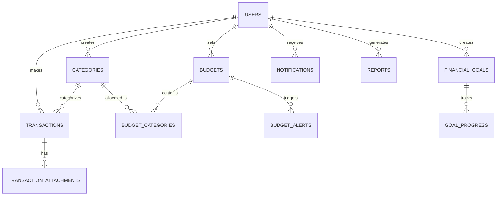

# CataDulu Personal Finance System - Database Architecture

## Overview
Comprehensive database schema for a personal finance management system supporting multi-user transactions, budgets, goals, and financial reporting.

---

## 1. Entity Relationship Diagram (ERD)

### Visual Representation (Mermaid ERD):



### Relationship Summary:
- **One-to-Many**: Users → Categories, Transactions, Budgets, Goals, Notifications, Reports
- **One-to-Many**: Categories → Transactions, Budget Categories
- **One-to-Many**: Transactions → Attachments
- **One-to-Many**: Budgets → Budget Categories, Budget Alerts
- **One-to-Many**: Financial Goals → Goal Progress
- **Many-to-Many** (via junction): Budgets ↔ Categories (through Budget Categories)

---

## 2. Database Schema Definition

### 2.1 USERS Table
**Purpose**: Store user account information and preferences

| Column | Type | Constraints | Description |
|--------|------|-----------|-------------|
| id | UUID | PK | Primary identifier |
| name | VARCHAR(255) | NOT NULL | User's full name |
| email | VARCHAR(255) | UNIQUE, NOT NULL | User email address |
| phone | VARCHAR(20) | NULLABLE | User phone number |
| password | VARCHAR(255) | NOT NULL | Bcrypt hashed password |
| avatar | VARCHAR(2048) | NULLABLE | User profile picture URL |
| bio | TEXT | NULLABLE | User biography |
| theme | ENUM('light','dark') | DEFAULT 'light' | UI theme preference |
| currency | VARCHAR(3) | DEFAULT 'USD' | Default currency code (ISO 4217) |
| is_active | BOOLEAN | DEFAULT TRUE | Account status |
| created_at | TIMESTAMP | NOT NULL | Account creation time |
| updated_at | TIMESTAMP | NOT NULL | Last update time |

**Indexes**:
```sql
CREATE UNIQUE INDEX idx_users_email ON users(email);
CREATE INDEX idx_users_is_active ON users(is_active);
CREATE INDEX idx_users_created_at ON users(created_at);
```

---

### 2.2 CATEGORIES Table
**Purpose**: User-defined transaction categories (expense/income)

| Column | Type | Constraints | Description |
|--------|------|-----------|-------------|
| id | UUID | PK | Primary identifier |
| user_id | UUID | FK → users(id) | Owner of category |
| name | VARCHAR(100) | NOT NULL | Category name |
| type | ENUM('income','expense') | NOT NULL | Category type |
| icon | VARCHAR(50) | DEFAULT 'folder' | Icon identifier |
| color | VARCHAR(7) | DEFAULT '#808080' | Hex color code |
| is_active | BOOLEAN | DEFAULT TRUE | Soft delete flag |
| created_at | TIMESTAMP | NOT NULL | Creation time |
| updated_at | TIMESTAMP | NOT NULL | Last update time |

**Indexes**:
```sql
CREATE INDEX idx_categories_user_id ON categories(user_id);
CREATE INDEX idx_categories_type ON categories(user_id, type);
CREATE INDEX idx_categories_is_active ON categories(user_id, is_active);
```

**Constraints**:
```sql
ALTER TABLE categories 
ADD CONSTRAINT fk_categories_user_id 
FOREIGN KEY (user_id) REFERENCES users(id) ON DELETE CASCADE;
```

---

### 2.3 TRANSACTIONS Table
**Purpose**: Record all financial transactions (income/expense)

| Column | Type | Constraints | Description |
|--------|------|-----------|-------------|
| id | UUID | PK | Primary identifier |
| user_id | UUID | FK → users(id) | Transaction owner |
| category_id | UUID | FK → categories(id) | Associated category |
| title | VARCHAR(255) | NOT NULL | Transaction title |
| amount | DECIMAL(15,2) | NOT NULL, CHECK > 0 | Transaction amount |
| type | ENUM('income','expense') | NOT NULL | Transaction type |
| description | TEXT | NULLABLE | Transaction notes |
| transaction_date | DATE | NOT NULL | Date transaction occurred |
| receipt_path | VARCHAR(2048) | NULLABLE | Receipt file path/URL |
| created_at | TIMESTAMP | NOT NULL | Record creation time |
| updated_at | TIMESTAMP | NOT NULL | Last update time |

**Indexes**:
```sql
CREATE INDEX idx_transactions_user_id ON transactions(user_id);
CREATE INDEX idx_transactions_category_id ON transactions(category_id);
CREATE INDEX idx_transactions_user_date ON transactions(user_id, transaction_date DESC);
CREATE INDEX idx_transactions_type ON transactions(user_id, type);
CREATE INDEX idx_transactions_date_range ON transactions(transaction_date);
```

**Constraints**:
```sql
ALTER TABLE transactions 
ADD CONSTRAINT fk_transactions_user_id 
FOREIGN KEY (user_id) REFERENCES users(id) ON DELETE CASCADE;

ALTER TABLE transactions 
ADD CONSTRAINT fk_transactions_category_id 
FOREIGN KEY (category_id) REFERENCES categories(id) ON DELETE RESTRICT;

ALTER TABLE transactions 
ADD CONSTRAINT chk_transactions_amount_positive 
CHECK (amount > 0);
```

---

### 2.4 TRANSACTION_ATTACHMENTS Table
**Purpose**: Store file attachments for transactions (receipts, invoices)

| Column | Type | Constraints | Description |
|--------|------|-----------|-------------|
| id | UUID | PK | Primary identifier |
| transaction_id | UUID | FK → transactions(id) | Parent transaction |
| file_path | VARCHAR(2048) | NOT NULL | S3/storage path |
| file_type | VARCHAR(50) | NOT NULL | MIME type (e.g., 'image/png') |
| created_at | TIMESTAMP | NOT NULL | Upload time |

**Indexes**:
```sql
CREATE INDEX idx_attachments_transaction_id ON transaction_attachments(transaction_id);
```

**Constraints**:
```sql
ALTER TABLE transaction_attachments 
ADD CONSTRAINT fk_attachments_transaction_id 
FOREIGN KEY (transaction_id) REFERENCES transactions(id) ON DELETE CASCADE;
```

---

### 2.5 BUDGETS Table
**Purpose**: User-defined spending limits and budget periods

| Column | Type | Constraints | Description |
|--------|------|-----------|-------------|
| id | UUID | PK | Primary identifier |
| user_id | UUID | FK → users(id) | Budget owner |
| title | VARCHAR(255) | NOT NULL | Budget name |
| amount | DECIMAL(15,2) | NOT NULL, CHECK > 0 | Total budget amount |
| spent | DECIMAL(15,2) | DEFAULT 0, CHECK ≥ 0 | Current spending |
| period | ENUM('monthly','yearly') | NOT NULL | Budget period |
| start_date | DATE | NOT NULL | Budget start date |
| end_date | DATE | NULLABLE | Budget end date (NULL = ongoing) |
| status | ENUM('active','completed','exceeded') | DEFAULT 'active' | Budget status |
| alert_threshold | DECIMAL(3,1) | DEFAULT 80.0 | Alert at % of budget |
| created_at | TIMESTAMP | NOT NULL | Creation time |
| updated_at | TIMESTAMP | NOT NULL | Last update time |

**Indexes**:
```sql
CREATE INDEX idx_budgets_user_id ON budgets(user_id);
CREATE INDEX idx_budgets_status ON budgets(user_id, status);
CREATE INDEX idx_budgets_period ON budgets(user_id, period);
CREATE INDEX idx_budgets_date_range ON budgets(start_date, end_date);
```

**Constraints**:
```sql
ALTER TABLE budgets 
ADD CONSTRAINT fk_budgets_user_id 
FOREIGN KEY (user_id) REFERENCES users(id) ON DELETE CASCADE;

ALTER TABLE budgets 
ADD CONSTRAINT chk_budgets_amount_positive 
CHECK (amount > 0);

ALTER TABLE budgets 
ADD CONSTRAINT chk_budgets_spent_valid 
CHECK (spent >= 0 AND spent <= amount * 1.5);

ALTER TABLE budgets 
ADD CONSTRAINT chk_budgets_end_date 
CHECK (end_date IS NULL OR end_date > start_date);

ALTER TABLE budgets 
ADD CONSTRAINT chk_budgets_threshold 
CHECK (alert_threshold BETWEEN 0 AND 100);
```

---

### 2.6 BUDGET_CATEGORIES Table
**Purpose**: Junction table linking categories to budgets (many-to-many)

| Column | Type | Constraints | Description |
|--------|------|-----------|-------------|
| id | UUID | PK | Primary identifier |
| budget_id | UUID | FK → budgets(id) | Parent budget |
| category_id | UUID | FK → categories(id) | Associated category |
| allocated_amount | DECIMAL(15,2) | NOT NULL, CHECK > 0 | Category allocation |

**Unique Constraint**:
```sql
ALTER TABLE budget_categories 
ADD CONSTRAINT uq_budget_categories 
UNIQUE (budget_id, category_id);
```

**Indexes**:
```sql
CREATE INDEX idx_budget_categories_budget_id ON budget_categories(budget_id);
CREATE INDEX idx_budget_categories_category_id ON budget_categories(category_id);
```

**Constraints**:
```sql
ALTER TABLE budget_categories 
ADD CONSTRAINT fk_budget_categories_budget_id 
FOREIGN KEY (budget_id) REFERENCES budgets(id) ON DELETE CASCADE;

ALTER TABLE budget_categories 
ADD CONSTRAINT fk_budget_categories_category_id 
FOREIGN KEY (category_id) REFERENCES categories(id) ON DELETE RESTRICT;

ALTER TABLE budget_categories 
ADD CONSTRAINT chk_allocated_amount_positive 
CHECK (allocated_amount > 0);
```

---

### 2.7 FINANCIAL_GOALS Table
**Purpose**: Track user financial objectives and milestones

| Column | Type | Constraints | Description |
|--------|------|-----------|-------------|
| id | UUID | PK | Primary identifier |
| user_id | UUID | FK → users(id) | Goal owner |
| title | VARCHAR(255) | NOT NULL | Goal name |
| description | TEXT | NULLABLE | Goal description |
| target_amount | DECIMAL(15,2) | NOT NULL, CHECK > 0 | Target value |
| current_amount | DECIMAL(15,2) | DEFAULT 0, CHECK ≥ 0 | Progress to date |
| deadline | DATE | NOT NULL | Target completion date |
| priority | ENUM('high','medium','low') | DEFAULT 'medium' | Goal priority |
| status | ENUM('active','completed','abandoned') | DEFAULT 'active' | Goal status |
| created_at | TIMESTAMP | NOT NULL | Creation time |
| updated_at | TIMESTAMP | NOT NULL | Last update time |

**Indexes**:
```sql
CREATE INDEX idx_financial_goals_user_id ON financial_goals(user_id);
CREATE INDEX idx_financial_goals_status ON financial_goals(user_id, status);
CREATE INDEX idx_financial_goals_priority ON financial_goals(user_id, priority);
CREATE INDEX idx_financial_goals_deadline ON financial_goals(deadline);
```

**Constraints**:
```sql
ALTER TABLE financial_goals 
ADD CONSTRAINT fk_financial_goals_user_id 
FOREIGN KEY (user_id) REFERENCES users(id) ON DELETE CASCADE;

ALTER TABLE financial_goals 
ADD CONSTRAINT chk_target_amount_positive 
CHECK (target_amount > 0);

ALTER TABLE financial_goals 
ADD CONSTRAINT chk_current_amount_valid 
CHECK (current_amount >= 0 AND current_amount <= target_amount * 1.5);

ALTER TABLE financial_goals 
ADD CONSTRAINT chk_deadline_future 
CHECK (deadline > CURDATE());
```

---

### 2.8 GOAL_PROGRESS Table
**Purpose**: Track incremental progress toward financial goals

| Column | Type | Constraints | Description |
|--------|------|-----------|-------------|
| id | UUID | PK | Primary identifier |
| goal_id | UUID | FK → financial_goals(id) | Parent goal |
| amount | DECIMAL(15,2) | NOT NULL, CHECK > 0 | Progress amount added |
| notes | TEXT | NULLABLE | Progress notes |
| recorded_at | DATE | NOT NULL | Date progress was made |
| created_at | TIMESTAMP | NOT NULL | Record creation time |

**Indexes**:
```sql
CREATE INDEX idx_goal_progress_goal_id ON goal_progress(goal_id);
CREATE INDEX idx_goal_progress_recorded_at ON goal_progress(recorded_at);
CREATE INDEX idx_goal_progress_goal_date ON goal_progress(goal_id, recorded_at);
```

**Constraints**:
```sql
ALTER TABLE goal_progress 
ADD CONSTRAINT fk_goal_progress_goal_id 
FOREIGN KEY (goal_id) REFERENCES financial_goals(id) ON DELETE CASCADE;

ALTER TABLE goal_progress 
ADD CONSTRAINT chk_progress_amount_positive 
CHECK (amount > 0);
```

---

### 2.9 NOTIFICATIONS Table
**Purpose**: Alert and reminder system for user events

| Column | Type | Constraints | Description |
|--------|------|-----------|-------------|
| id | UUID | PK | Primary identifier |
| user_id | UUID | FK → users(id) | Notification recipient |
| type | ENUM('alert','reminder','system') | NOT NULL | Notification type |
| title | VARCHAR(255) | NOT NULL | Notification title |
| message | TEXT | NOT NULL | Notification message |
| related_type | ENUM('budget','goal','transaction') | NULLABLE | Related entity type |
| related_id | UUID | NULLABLE | Related entity ID |
| is_read | BOOLEAN | DEFAULT FALSE | Read status |
| created_at | TIMESTAMP | NOT NULL | Creation time |
| updated_at | TIMESTAMP | NOT NULL | Last update time |

**Indexes**:
```sql
CREATE INDEX idx_notifications_user_id ON notifications(user_id);
CREATE INDEX idx_notifications_is_read ON notifications(user_id, is_read);
CREATE INDEX idx_notifications_type ON notifications(user_id, type);
CREATE INDEX idx_notifications_created_at ON notifications(user_id, created_at DESC);
```

**Constraints**:
```sql
ALTER TABLE notifications 
ADD CONSTRAINT fk_notifications_user_id 
FOREIGN KEY (user_id) REFERENCES users(id) ON DELETE CASCADE;
```

---

### 2.10 BUDGET_ALERTS Table
**Purpose**: Track budget threshold violations

| Column | Type | Constraints | Description |
|--------|------|-----------|-------------|
| id | UUID | PK | Primary identifier |
| budget_id | UUID | FK → budgets(id) | Associated budget |
| alert_type | ENUM('approaching','exceeded') | NOT NULL | Alert reason |
| triggered_at | TIMESTAMP | NOT NULL | Alert trigger time |
| acknowledged_at | TIMESTAMP | NULLABLE | User acknowledgment time |

**Indexes**:
```sql
CREATE INDEX idx_budget_alerts_budget_id ON budget_alerts(budget_id);
CREATE INDEX idx_budget_alerts_triggered_at ON budget_alerts(triggered_at DESC);
CREATE INDEX idx_budget_alerts_unacknowledged ON budget_alerts(budget_id, acknowledged_at);
```

**Constraints**:
```sql
ALTER TABLE budget_alerts 
ADD CONSTRAINT fk_budget_alerts_budget_id 
FOREIGN KEY (budget_id) REFERENCES budgets(id) ON DELETE CASCADE;
```

---

### 2.11 REPORTS Table
**Purpose**: Store generated financial reports

| Column | Type | Constraints | Description |
|--------|------|-----------|-------------|
| id | UUID | PK | Primary identifier |
| user_id | UUID | FK → users(id) | Report owner |
| report_type | ENUM('daily','weekly','monthly','yearly') | NOT NULL | Report period |
| period_start | DATE | NOT NULL | Report start date |
| period_end | DATE | NOT NULL | Report end date |
| total_income | DECIMAL(15,2) | DEFAULT 0 | Total income in period |
| total_expense | DECIMAL(15,2) | DEFAULT 0 | Total expenses in period |
| generated_at | TIMESTAMP | NOT NULL | Report generation time |
| created_at | TIMESTAMP | NOT NULL | Record creation time |

**Indexes**:
```sql
CREATE INDEX idx_reports_user_id ON reports(user_id);
CREATE INDEX idx_reports_report_type ON reports(user_id, report_type);
CREATE INDEX idx_reports_period ON reports(period_start, period_end);
CREATE INDEX idx_reports_generated_at ON reports(generated_at DESC);
```

**Constraints**:
```sql
ALTER TABLE reports 
ADD CONSTRAINT fk_reports_user_id 
FOREIGN KEY (user_id) REFERENCES users(id) ON DELETE CASCADE;

ALTER TABLE reports 
ADD CONSTRAINT chk_reports_date_range 
CHECK (period_end >= period_start);
```

---

## 3. Relationship & Cardinality Matrix

| Source Table | Target Table | Relationship | Cardinality | Cascade Delete |
|--------------|--------------|--------------|-------------|-----------------|
| users | categories | One-to-Many | 1..∞ | YES |
| users | transactions | One-to-Many | 1..∞ | YES |
| users | budgets | One-to-Many | 1..∞ | YES |
| users | financial_goals | One-to-Many | 1..∞ | YES |
| users | notifications | One-to-Many | 1..∞ | YES |
| users | reports | One-to-Many | 1..∞ | YES |
| categories | transactions | One-to-Many | 1..∞ | NO (RESTRICT) |
| categories | budget_categories | One-to-Many | 1..∞ | NO (RESTRICT) |
| transactions | transaction_attachments | One-to-Many | 1..∞ | YES |
| budgets | budget_categories | One-to-Many | 1..∞ | YES |
| budgets | budget_alerts | One-to-Many | 1..∞ | YES |
| financial_goals | goal_progress | One-to-Many | 1..∞ | YES |

---

## 4. Indexing Strategy

### Performance Indexes
1. **User-scoped queries**: Most queries filter by `user_id` first
   - Apply on: categories, transactions, budgets, financial_goals, notifications, reports

2. **Time-based queries**: Sorting/filtering by dates
   - Apply on: transactions(transaction_date), budgets(start_date), notifications(created_at)

3. **Status filters**: Common WHERE clauses
   - Apply on: categories(is_active), budgets(status), financial_goals(status)

4. **Composite indexes**: Frequently combined filters
   - `(user_id, type)` on categories and transactions
   - `(user_id, is_active)` on categories
   - `(user_id, status)` on budgets and goals

### Query Optimization Guidelines
```sql
-- Recommended indexes for common queries:
CREATE INDEX idx_user_transactions_date ON transactions(user_id, transaction_date DESC);
CREATE INDEX idx_user_categories_type ON categories(user_id, type, is_active);
CREATE INDEX idx_budget_spending_query ON budget_categories(budget_id, allocated_amount);
CREATE INDEX idx_goal_progress_tracking ON goal_progress(goal_id, recorded_at DESC);
CREATE INDEX idx_notification_dashboard ON notifications(user_id, is_read, created_at DESC);
```

---

## 5. Data Integrity Rules

### Foreign Key Constraints
```
fk_categories_user_id → users(id) ON DELETE CASCADE
fk_transactions_user_id → users(id) ON DELETE CASCADE
fk_transactions_category_id → categories(id) ON DELETE RESTRICT
fk_budgets_user_id → users(id) ON DELETE CASCADE
fk_budget_categories_budget_id → budgets(id) ON DELETE CASCADE
fk_budget_categories_category_id → categories(id) ON DELETE RESTRICT
fk_financial_goals_user_id → users(id) ON DELETE CASCADE
fk_goal_progress_goal_id → financial_goals(id) ON DELETE CASCADE
fk_notifications_user_id → users(id) ON DELETE CASCADE
fk_budget_alerts_budget_id → budgets(id) ON DELETE CASCADE
fk_transaction_attachments_transaction_id → transactions(id) ON DELETE CASCADE
fk_reports_user_id → users(id) ON DELETE CASCADE
```

### Cascade Delete Policies
**Cascade (ON DELETE CASCADE)**:
- Deleting user → deletes all related categories, transactions, budgets, goals, notifications, reports
- Deleting transaction → deletes all attachments
- Deleting budget → deletes budget_categories and budget_alerts
- Deleting goal → deletes goal_progress entries

**Restrict (ON DELETE RESTRICT)**:
- Cannot delete category if transactions exist
- Cannot delete category if budget_categories reference it
- Ensures data consistency: transactions/budgets always have valid categories

### Unique Constraints
```sql
UNIQUE(email) -- users table
UNIQUE(budget_id, category_id) -- budget_categories table
```

### Check Constraints
```sql
-- Amount validations
amount > 0 (transactions, budgets, financial_goals, goal_progress)
spent >= 0 AND spent <= amount * 1.5 (budgets)

-- Date validations
deadline > CURDATE() (financial_goals)
end_date IS NULL OR end_date > start_date (budgets)
period_end >= period_start (reports)

-- Threshold validations
alert_threshold BETWEEN 0 AND 100 (budgets)

-- Goal progress validations
current_amount >= 0 AND current_amount <= target_amount * 1.5 (goals)
```

### Default Values
```
categories.is_active = TRUE
transactions.created_at = CURRENT_TIMESTAMP
budgets.spent = 0.00
budgets.status = 'active'
budgets.alert_threshold = 80.0
financial_goals.current_amount = 0.00
financial_goals.status = 'active'
financial_goals.priority = 'medium'
notifications.is_read = FALSE
goal_progress.recorded_at = CURDATE()
```

---

## 6. Performance Considerations

### Query Optimization Tips

1. **Dashboard Query** - User overview
```sql
SELECT 
    u.id, u.name, u.currency,
    SUM(CASE WHEN t.type = 'income' THEN t.amount ELSE 0 END) as total_income,
    SUM(CASE WHEN t.type = 'expense' THEN t.amount ELSE 0 END) as total_expense,
    (SELECT COUNT(*) FROM budgets b WHERE b.user_id = u.id AND b.status = 'exceeded') as exceeded_budgets
FROM users u
LEFT JOIN transactions t ON u.id = t.user_id 
    AND t.transaction_date >= CURDATE() - INTERVAL 30 DAY
WHERE u.id = ?
GROUP BY u.id;
```

2. **Category Spending Query**
```sql
SELECT c.id, c.name, COUNT(t.id) as count, SUM(t.amount) as total
FROM categories c
LEFT JOIN transactions t ON c.id = t.category_id 
    AND t.transaction_date BETWEEN ? AND ?
WHERE c.user_id = ? AND c.type = 'expense'
GROUP BY c.id
ORDER BY total DESC;
```

3. **Budget Tracking Query**
```sql
SELECT 
    b.id, b.title, b.amount, b.spent,
    ROUND((b.spent / b.amount) * 100, 2) as percentage_spent,
    (b.amount - b.spent) as remaining
FROM budgets b
WHERE b.user_id = ? AND b.status IN ('active', 'exceeded')
ORDER BY (b.spent / b.amount) DESC;
```

---

## 7. Implementation Summary

### Migration Order
1. users
2. categories
3. transactions
4. transaction_attachments
5. budgets
6. budget_categories
7. financial_goals
8. goal_progress
9. notifications
10. budget_alerts
11. reports

### Key Characteristics
✅ Strong data integrity with foreign key constraints
✅ Efficient querying with strategic indexing
✅ Scalable design supporting millions of transactions
✅ Flexible budget and goal tracking
✅ Audit trails with created_at/updated_at timestamps
✅ Multi-user isolation
✅ Clear cascade policies preventing orphaned data
